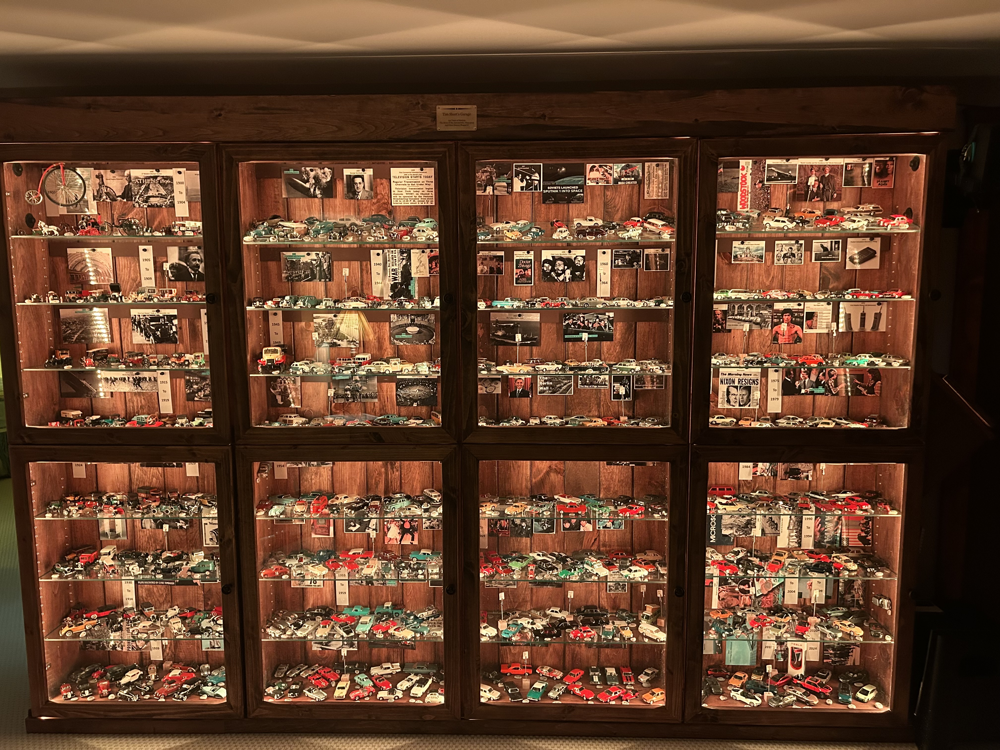
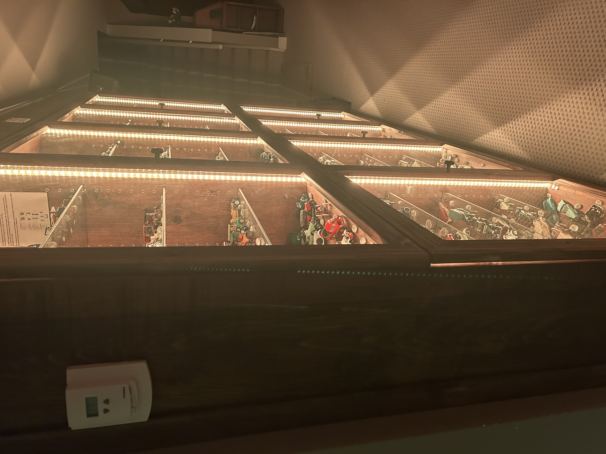
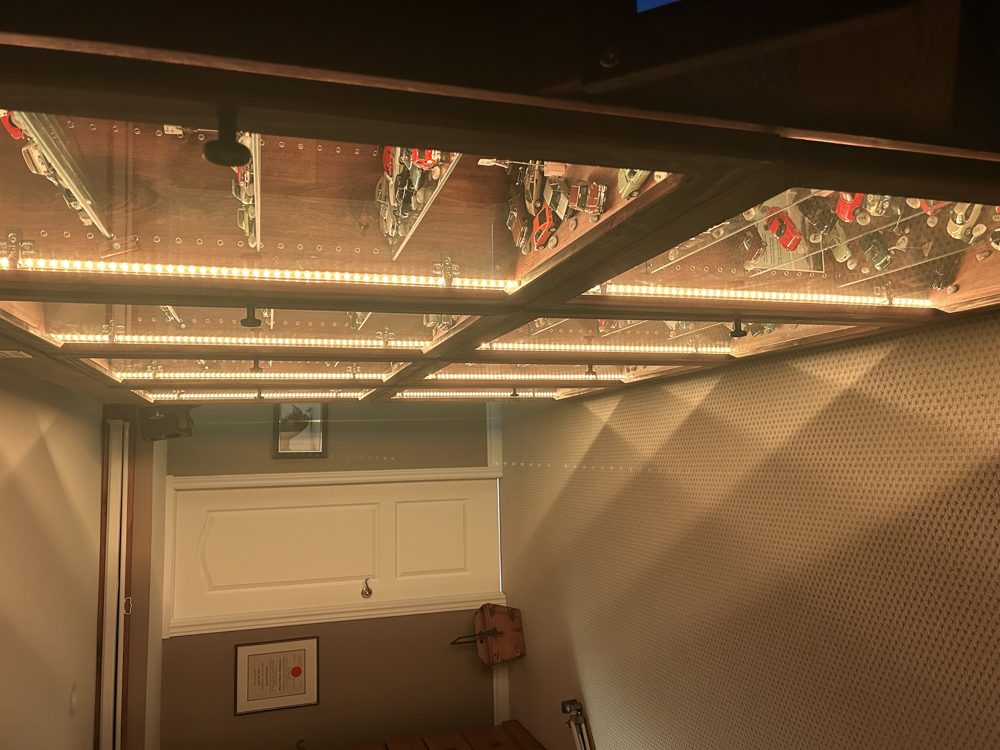
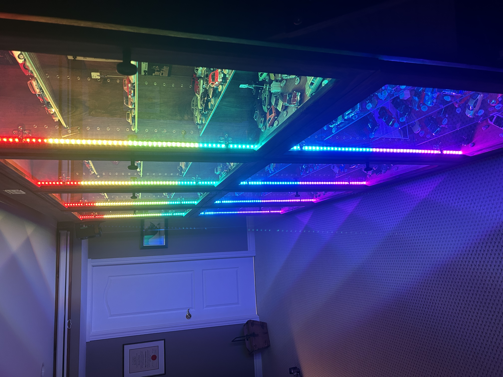

# LED Driver

A USB-controlled addressable LED strip driver built to illuminate a model car display cabinet. The cabinet houses 500+ 1/43rd scale model cars across 4 vertical sections, each lit by two 120-LED strips (960 LEDs total). Any USB host can control the LEDs—in this case, a Raspberry Pi with a touchscreen running a web interface.

<table>
  <tr>
    <td colspan="3"></td>
  </tr>
  <tr>
    <td></td>
    <td></td>
    <td></td>
  </tr>
</table>

## Hardware

- **MCU**: STM32F103RGT6 (Cortex-M3 @ 72 MHz, USB FS)
- **LEDs**: 8 × SK6812 addressable RGB strips (120 LEDs each)
- **Interface**: USB-C (CDC virtual COM port)
- **LED Control**: DMA-driven PWM for timing-critical waveform generation
- **PCB**: 4-layer, KiCad

## Repository layout

- `LED-DriverPCB/` — KiCad project (schematics, board, libraries)
- `LED-DriverPCB/Manufacturing/` — Gerbers, BOM, and pick-and-place files
- `LED-Driver-Firmware-RevB/` — STM32CubeIDE project
- `Garage-Files/` — Web control interface and startup audio